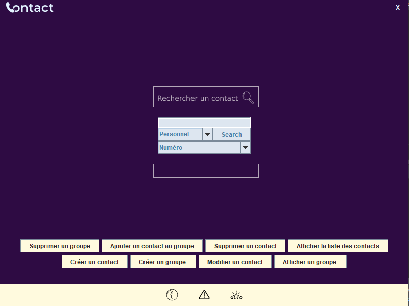
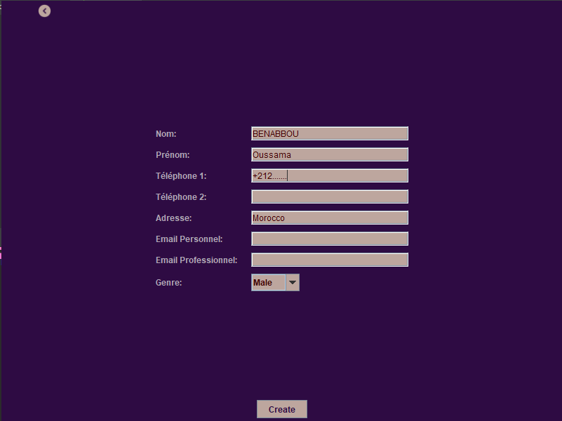
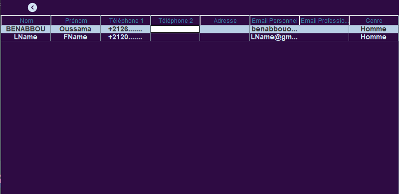

# JAVA-Contact-App

This application is designed to help you efficiently manage your contact list. You can add, delete, modify, and search for contacts and contact groups, as well as view the details of each contact.

## Technologies Used

- **Java:** Programming language used for the development of the application.
- **Swing:** Java graphical library used for creating the user interface.
- **h2:** Database management system used to store contact information.

## Features

1. **Create a New Contact:** Easily add new contacts to your list.

2. **Display Contacts:** View your contacts in order for quick access.

3. **Delete a Contact:** Remove unwanted contacts from your list.

4. **Edit a Contact:** Modify contact details to keep information up-to-date.

5. **Search for a Contact by Number:** Enter a personal or professional number, and the application will display other related information.

6. **Create Contact Groups:** Organize your contacts into groups such as family, friends, and more. Each group can contain zero or more contacts.

7. **Delete a Group:** Removing a group does not delete the associated contacts. Additionally, you can search for a group by its name.

8. **Automatically Creation of Groups:** Automatically create groups with contacts sharing the same name.

9. **Advanced Contact Search:** Our application offers a robust search functionality that allows users to find contacts effortlessly. When searching by name , users can quickly locate the desired contact. For those seeking even more powerful search capabilities, we provide advanced features such as phonetic search using SQL SOUNDEX, enabling users to find contacts with similar sounding names, and fuzzy name search employing the String Edit Distance Algorithm, which ensures that contacts can be retrieved even in the presence of minor spelling errors in the search query.
10. **Log file:** Your history is saved in a log file

## How to Run the Application

1. Ensure you have Java installed on your machine.
2. Clone or download this repository to your computer.
3. Open the project in your Java development environment.
4. Open the `mode.properties` file (located in the `resources` folder) and choose the application mode (`--Console--` or `--GUI--`). By default, the GUI mode is used.
5. Open the `conf.properties` file (located in the `resources` folder) and choose a name for the database (by default, `dbapp2` is used).
6. The database will be installed during the first run of the application in your computer's home directory.
7. Compile and execute the `Main.java` file (located in the IHM package) to launch the application.

## Screenshots : 
    Create contact :

    List your contacts : 

## Author

**BENABBOU Oussama**

For any questions or additional assistance, please contact me .
For more information about the application, click on the "About" button located at the bottom of the application.

